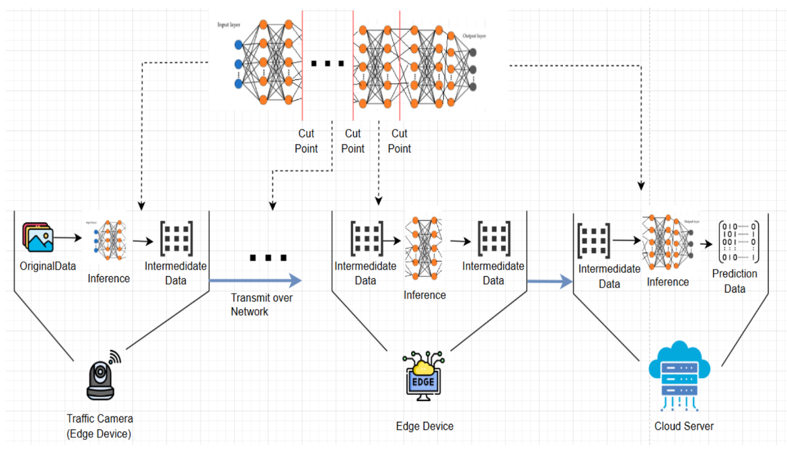

# Split Inference System

A scalable, resilient, and observable distributed system for performing Split Inference on deep learning models, designed for Edge-Cloud computing scenarios.

This project demonstrates how to partition a large AI model (e.g., YOLOv8) and execute it across multiple independent workers, coordinated by a central server and supported by robust infrastructure components like RabbitMQ and Redis.

## System Architecture

The system is designed with a decoupled, asynchronous, service-oriented architecture. It consists of three main logical planes: a Control Plane for coordination, an Execution Plane for computation, and an Infrastructure Plane for messaging and caching.



## Prerequisites

Before running the application, ensure you have the following installed:
* Python 3.9+
* Docker & Docker Compose
* `make` (optional, for using Makefile shortcuts)

## Configuration

All system configurations are managed in the `configs/config.yaml` file. This file is mounted into all service containers when using Docker Compose.

Key configuration parameters include:
* **`app`**: General settings like `run_duration_seconds`.
* **`server`**: Defines the model `cut-layer`, the number of expected `clients` for each layer, and the `model` name.
* **`client`**: Contains client-side performance tuning parameters like `imgsz`, `internal_queue_maxsize`, and `io_prefetch_count`.
* **`rabbit` & `redis`**: Connection details for the infrastructure services. **Note:** When running with Docker Compose, these should be set to the service names (e.g., `address: rabbitmq`, `host: redis`).

## How to Run

### 1. Using Docker Compose (Recommended)

This is the easiest and most reliable way to run the entire distributed system. A `Makefile` is provided for convenience.

* **To start the entire stack (RabbitMQ, Redis, Server, Clients):**
    ```bash
    make start
    ```
* **To stop and remove all containers:**
    ```bash
    make stop
    ```
* **To view logs from all services:**
    ```bash
    make logs
    ```

### 2. Local Development (Manual Run)

This method is suitable for debugging individual components. Ensure RabbitMQ and Redis are running and accessible from your local machine.

**Important:** Run all commands from the **root directory** of the project to ensure Python can find the modules correctly.

1.  **Start the Server:**
    The server must be running first to listen for client registrations.
    ```bash
    python -m app.server --config configs/config.yaml
    ```

2.  **Start the Client Workers:**
    Open new terminal windows for each client you need to run. The number of clients must match the `server.clients` configuration.

    * **Start a Layer 1 Client:**
        ```bash
        python -m app.client --layer_id 1 --config configs/config.yaml
        ```

    * **Start a Layer 2 Client:**
        ```bash
        python -m app.client --layer_id 2 --config configs/config.yaml
        ```

    **Arguments:**
    * `--layer_id`: **(Required)** The layer this client belongs to (starts from 1).
    * `--device`: (Optional) The device for inference (e.g., `cpu`, `cuda`).
    * `--config`: (Optional) Path to the configuration file.

## Project Structure

```
split_inference/
├── app/                  # Application entrypoints (server.py, client.py)
├── configs/              # Configuration files (config.yaml)
├── core/                 # Core application logic (server, client workers, utils)
├── deployments/          # Deployment manifests (docker-compose, kubernetes)
├── docs/                 # Documentation and diagrams
├── logs/                 # Directory for log files
├── models/               # Pre-trained model files (.pt)
├── videos/               # Source video files
└── requirements.txt      # Python dependencies
